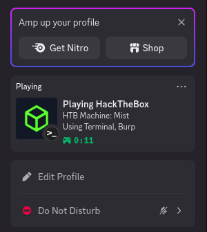

# HTB-Activity-Presenter

<div align="center">
    
  [](https://opensource.org/licenses/MIT)
  [](https://www.python.org/downloads/)
  [](https://discord.com)
  
  *Show off your HackTheBox activities in Discord with style!*
</div>

## 🖥️ Preview



## ✨ Features

- 🎮 Show your current HackTheBox machine in Discord status
- 🛠️ Display which tools you're using (terminal, Burp, nmap, and more)
- ⏱️ Track your session time automatically
- 🔗 Include direct links to HackTheBox
- 🏃‍♂️ Run in background mode without blocking your terminal
- 🔄 Auto-updating presence that stays active

## 📋 Prerequisites

- Python 3.6 or higher
- Discord account
- [Discord Application](https://discord.com/developers/applications) with Rich Presence assets

## 🚀 Installation

1. Clone this repository:
   ```bash
   git clone https://github.com/yourusername/htb-presence.git
   cd htb-presence
   ```

2. Install required packages:
   ```bash
   pip install pypresence
   ```

3. Create a Discord Application:
   - Go to [Discord Developer Portal](https://discord.com/developers/applications)
   - Create a new application (the name will show as "Playing {name}")
   - Copy your Client ID and paste it in the `CLIENT_ID` variable in the script
   - Under Rich Presence → Art Assets, upload your images:
     - `htb_logo` (large image)
     - Tool icons: `terminal`, `burp`, `nmap`, `metasploit`, `wireshark`, `ffuf`, `gobuster`, `dirb`

4. Set up the executable:
   ```bash
   chmod +x htb_presence.py
   sudo ln -s $(pwd)/htb_presence.py /usr/local/bin/htbpresence
   ```

## 💻 Usage

### Interactive Mode

```bash
htbpresence
```

### Command Line Arguments

```bash
# Specify machine and tools
htbpresence --machine Previse --tools burp nmap gobuster

# Run in background
htbpresence --machine Previse --tools burp nmap --background

# Check if presence is running
htbpresence --status

# Stop a running presence
htbpresence --stop
```

## 🧰 Available Tools

The following tools have icons supported by default:
- `terminal` - Command line terminal
- `burp` - Burp Suite
- `nmap` - Network mapper
- `metasploit` - Metasploit Framework
- `wireshark` - Packet analyzer
- `ffuf` - Fuzz Faster U Fool
- `gobuster` - Directory/file brute forcing
- `dirb` - URL bruteforcing

## 🎨 Customization

### Adding More Tool Icons

1. Upload new icons to your Discord Application's Rich Presence Art Assets
2. Add the icon name to the `valid_tool_icons` list in the script

### Modifying Button Links

You can change the button links in the `start_presence()` function:

```python
buttons=[
    {"label": "HackTheBox", "url": "https://www.hackthebox.com/"},
    {"label": "Your Custom Link", "url": "https://your-url.com"}
]
```

## 🛠️ Troubleshooting

- **Presence disappears after a few seconds**: Make sure Discord is not in "invisible" mode
- **Tool icon not showing**: Verify the icon name matches exactly what's in your Discord application
- **Background mode not working**: Check if another instance is already running

## 📜 License

This project is licensed under the MIT License - see the [LICENSE](LICENSE) file for details.

## 🙏 Acknowledgements

- [pypresence](https://github.com/qwertyquerty/pypresence) - Python implementation for Discord IPC
- [HackTheBox](https://www.hackthebox.com/) - For the awesome platform

---

<div align="center">
  <sub>Built with ❤️ by <a href="https://github.com/yourusername">Your Username</a></sub>
</div>
